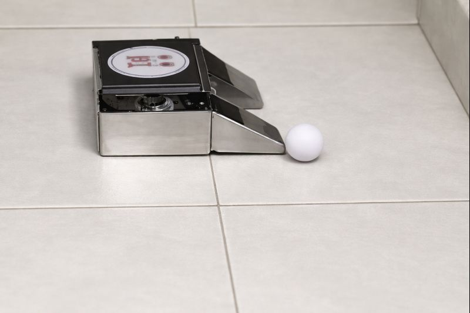

# ⚽ Soccer Bot (Ball Chasing Robot)

An Arduino-based Soccer Bot that detects a ball and automatically moves toward it to push or kick it forward.

---

## 📌 Project Overview

The Soccer Bot uses distance sensing to locate a ball and simple motor control logic to chase and push it, mimicking a basic soccer-playing robot.

---

## 🧠 Working Principle

- The robot continuously scans for a ball using a sensor.
- When the ball is detected within a set range, the robot moves forward.
- If the ball is not detected, the robot rotates to search for it.
- Once aligned, the robot pushes the ball like a soccer bot.

---

## 🔧 Components Used

- Arduino UNO  
- L298N Motor Driver  
- DC Motors with Wheels  
- Ultrasonic Sensor (HC-SR04) / IR Sensor  
- Robot Chassis  
- Battery Pack  

---

## 🛠️ Pin Configuration

| Component | Arduino Pins |
|---------|--------------|
| Motor ENA | D5 |
| Motor ENB | D6 |
| Motor IN1 | D7 |
| Motor IN2 | D8 |
| Motor IN3 | D9 |
| Motor IN4 | D10 |
| Ultrasonic TRIG | D2 |
| Ultrasonic ECHO | D3 |

---

## 📂 Project Structure

---

## ▶️ How to Run

1. Connect all components as per the circuit.
2. Upload `soccer_bot.ino` to Arduino UNO.
3. Place a ball in front of the robot.
4. Power the robot and observe automatic ball chasing.

---

## 📸 Output

The robot:
- Searches for the ball
- Moves toward it
- Pushes it forward like a soccer player

---

## 🚀 Future Enhancements

- Left–right ball tracking using multiple IR sensors  
- Servo-based sensor rotation  
- Goal detection  
- Bluetooth / app control  
- AI-based soccer strategy  

---

## 👩‍💻 Author
 
**Mayank**
**Aastha Agarwal** 

Project developed for robotics and embedded systems learning.

---

## 📜 License

This project is open-source and free to use for educational purposes.
